# ComplexityUniverse — ER Diagram Reference

> **DBMS Course Project** — This document contains every detail you need to draw the Entity-Relationship (ER) diagrams for the `complexity_universe` database.

---

## Table of Contents

- [1. Complete ER Diagram (Mermaid)](#1-complete-er-diagram-mermaid)
- [2. Entities — Full Attribute List](#2-entities--full-attribute-list)
  - [2.1 users](#21-users)
  - [2.2 user_profiles](#22-user_profiles)
  - [2.3 analysis_prompts](#23-analysis_prompts)
  - [2.4 code_analyses](#24-code_analyses)
  - [2.5 complexity_topics](#25-complexity_topics)
  - [2.6 topic_examples](#26-topic_examples)
  - [2.7 user_saved_topics](#27-user_saved_topics)
  - [2.8 activity_log](#28-activity_log)
  - [2.9 app_settings](#29-app_settings)
- [3. Relationships — Complete Details](#3-relationships--complete-details)
- [4. Cardinality Summary Table](#4-cardinality-summary-table)
- [5. Foreign Key Constraints Summary](#5-foreign-key-constraints-summary)
- [6. ER Diagram Drawing Guide](#6-er-diagram-drawing-guide)
- [7. Relational Schema (Textual Notation)](#7-relational-schema-textual-notation)

---

## 1. Complete ER Diagram (Mermaid)

You can paste this into any Mermaid renderer (VS Code, GitHub, [mermaid.live](https://mermaid.live)) to get a rendered ER diagram.

```mermaid
erDiagram
    users {
        INT_UNSIGNED id PK "AUTO_INCREMENT"
        VARCHAR_100 name "NOT NULL"
        VARCHAR_190 email "UNIQUE, NOT NULL"
        VARCHAR_255 password_hash "NOT NULL"
        DATETIME last_login_at "NULL"
        ENUM role "user | admin, DEFAULT user"
        ENUM status "active | suspended, DEFAULT active"
        INT_UNSIGNED analysis_count "DEFAULT 0"
        TIMESTAMP created_at "DEFAULT CURRENT_TIMESTAMP"
        TIMESTAMP updated_at "ON UPDATE CURRENT_TIMESTAMP"
    }

    user_profiles {
        INT_UNSIGNED id PK "AUTO_INCREMENT"
        INT_UNSIGNED user_id FK "UNIQUE, NOT NULL"
        VARCHAR_140 headline "DEFAULT 'Curious about the cost of code'"
        VARCHAR_500 bio "DEFAULT ''"
        VARCHAR_100 location "DEFAULT ''"
        VARCHAR_60 avatar_seed "DEFAULT ''"
    }

    analysis_prompts {
        TINYINT_UNSIGNED id PK "AUTO_INCREMENT"
        VARCHAR_80 name "NOT NULL"
        MEDIUMTEXT prompt_template "NOT NULL"
        TINYINT is_active "DEFAULT 1"
        INT_UNSIGNED version "DEFAULT 1"
        INT_UNSIGNED updated_by FK "NULL"
        TIMESTAMP created_at "DEFAULT CURRENT_TIMESTAMP"
        TIMESTAMP updated_at "ON UPDATE CURRENT_TIMESTAMP"
    }

    code_analyses {
        BIGINT_UNSIGNED id PK "AUTO_INCREMENT"
        INT_UNSIGNED user_id FK "NOT NULL"
        VARCHAR_140 title "DEFAULT 'Untitled analysis'"
        VARCHAR_30 language "DEFAULT 'javascript'"
        MEDIUMTEXT code_text "NOT NULL"
        INT_UNSIGNED code_lines "GENERATED STORED"
        VARCHAR_40 time_complexity "NOT NULL"
        VARCHAR_40 space_complexity "NOT NULL"
        TEXT summary "NOT NULL"
        MEDIUMTEXT detailed_analysis "NOT NULL"
        ENUM detail_mode "short | detailed, DEFAULT detailed"
        VARCHAR_20 engine "DEFAULT 'gemini'"
        INT_UNSIGNED prompt_version "NULL"
        TIMESTAMP created_at "DEFAULT CURRENT_TIMESTAMP"
        TIMESTAMP updated_at "ON UPDATE CURRENT_TIMESTAMP"
    }

    complexity_topics {
        INT_UNSIGNED id PK "AUTO_INCREMENT"
        VARCHAR_120 topic_name "NOT NULL"
        VARCHAR_140 slug "UNIQUE, NOT NULL"
        VARCHAR_60 category "DEFAULT 'Fundamentals'"
        ENUM difficulty "Beginner | Intermediate | Advanced"
        VARCHAR_40 time_complexity "NULL"
        VARCHAR_40 space_complexity "NULL"
        VARCHAR_300 summary "DEFAULT ''"
        MEDIUMTEXT notes_html "NOT NULL"
        SMALLINT sort_order "DEFAULT 0"
        TINYINT is_published "DEFAULT 1"
        TIMESTAMP created_at "DEFAULT CURRENT_TIMESTAMP"
        TIMESTAMP updated_at "ON UPDATE CURRENT_TIMESTAMP"
    }

    topic_examples {
        INT_UNSIGNED id PK "AUTO_INCREMENT"
        INT_UNSIGNED topic_id FK "NOT NULL"
        VARCHAR_140 title "NOT NULL"
        VARCHAR_30 language "DEFAULT 'javascript'"
        MEDIUMTEXT code_text "NOT NULL"
        MEDIUMTEXT analysis_html "NOT NULL"
        VARCHAR_40 time_complexity "NULL"
        VARCHAR_40 space_complexity "NULL"
        SMALLINT sort_order "DEFAULT 0"
        TIMESTAMP created_at "DEFAULT CURRENT_TIMESTAMP"
    }

    user_saved_topics {
        BIGINT_UNSIGNED id PK "AUTO_INCREMENT"
        INT_UNSIGNED user_id FK "NOT NULL"
        INT_UNSIGNED topic_id FK "NOT NULL"
        VARCHAR_255 note "DEFAULT ''"
        TIMESTAMP saved_at "DEFAULT CURRENT_TIMESTAMP"
    }

    activity_log {
        BIGINT_UNSIGNED id PK "AUTO_INCREMENT"
        INT_UNSIGNED user_id FK "NULL"
        VARCHAR_40 action "NOT NULL"
        VARCHAR_40 entity "NOT NULL"
        BIGINT_UNSIGNED entity_id "NULL"
        VARCHAR_255 detail "DEFAULT ''"
        TIMESTAMP created_at "DEFAULT CURRENT_TIMESTAMP"
    }

    app_settings {
        VARCHAR_60 setting_key PK "NOT NULL"
        TEXT setting_value "NOT NULL"
        TIMESTAMP updated_at "ON UPDATE CURRENT_TIMESTAMP"
    }

    users ||--|| user_profiles : "has profile"
    users ||--o{ code_analyses : "saves analyses"
    users ||--o{ user_saved_topics : "bookmarks topics"
    users ||--o{ activity_log : "generates activity"
    users ||--o| analysis_prompts : "edits prompts"
    complexity_topics ||--o{ topic_examples : "has examples"
    complexity_topics ||--o{ user_saved_topics : "bookmarked by users"
```



---

## 2. Entities — Full Attribute List

Below is every entity (table) with every attribute, its data type, constraints, and role in the ER diagram.

### 2.1 users

> **The central entity** — every other entity (except `app_settings` and `complexity_topics`) directly or indirectly references `users`.

| Attribute | Data Type | Constraints | ER Notation |
|---|---|---|---|
| `id` | INT UNSIGNED | PRIMARY KEY, AUTO_INCREMENT | 🔑 Primary Key |
| `name` | VARCHAR(100) | NOT NULL | Simple Attribute |
| `email` | VARCHAR(190) | NOT NULL, UNIQUE (`uq_users_email`) | Simple Attribute (unique) |
| `password_hash` | VARCHAR(255) | NOT NULL | Simple Attribute |
| `last_login_at` | DATETIME | NULL, DEFAULT NULL | Simple Attribute (optional) |
| `role` | ENUM('user', 'admin') | NOT NULL, DEFAULT 'user' | Simple Attribute |
| `status` | ENUM('active', 'suspended') | NOT NULL, DEFAULT 'active' | Simple Attribute |
| `analysis_count` | INT UNSIGNED | NOT NULL, DEFAULT 0 | **Derived Attribute** (maintained by triggers on `code_analyses`) |
| `created_at` | TIMESTAMP | NOT NULL, DEFAULT CURRENT_TIMESTAMP | Simple Attribute |
| `updated_at` | TIMESTAMP | NOT NULL, ON UPDATE CURRENT_TIMESTAMP | Simple Attribute |

**Indexes:**
- `uq_users_email` — Unique index on `email`
- `idx_users_role` — Index on `role`

---

### 2.2 user_profiles

> **1:1 relationship with `users`** — created automatically by the `trg_users_after_insert` trigger.

| Attribute | Data Type | Constraints | ER Notation |
|---|---|---|---|
| `id` | INT UNSIGNED | PRIMARY KEY, AUTO_INCREMENT | 🔑 Primary Key |
| `user_id` | INT UNSIGNED | NOT NULL, UNIQUE (`uq_profile_user`), FK → `users.id` | 🔗 Foreign Key |
| `headline` | VARCHAR(140) | NOT NULL, DEFAULT 'Curious about the cost of code' | Simple Attribute |
| `bio` | VARCHAR(500) | NOT NULL, DEFAULT '' | Simple Attribute |
| `location` | VARCHAR(100) | NOT NULL, DEFAULT '' | Simple Attribute |
| `avatar_seed` | VARCHAR(60) | NOT NULL, DEFAULT '' | Simple Attribute |

**Foreign Key:**
- `fk_profile_user`: `user_id` → `users(id)` — ON DELETE **CASCADE**, ON UPDATE **CASCADE**

**Participation:** Total on `user_profiles` side (every profile must belong to a user), Total on `users` side (trigger ensures every user gets a profile).

---

### 2.3 analysis_prompts

> **Admin-editable AI prompt template.** Versioned automatically by a trigger on update.

| Attribute | Data Type | Constraints | ER Notation |
|---|---|---|---|
| `id` | TINYINT UNSIGNED | PRIMARY KEY, AUTO_INCREMENT | 🔑 Primary Key |
| `name` | VARCHAR(80) | NOT NULL | Simple Attribute |
| `prompt_template` | MEDIUMTEXT | NOT NULL | Simple Attribute |
| `is_active` | TINYINT(1) | NOT NULL, DEFAULT 1 | Simple Attribute |
| `version` | INT UNSIGNED | NOT NULL, DEFAULT 1 | Simple Attribute (auto-incremented by trigger) |
| `updated_by` | INT UNSIGNED | NULL, FK → `users.id` | 🔗 Foreign Key (optional) |
| `created_at` | TIMESTAMP | NOT NULL, DEFAULT CURRENT_TIMESTAMP | Simple Attribute |
| `updated_at` | TIMESTAMP | NOT NULL, ON UPDATE CURRENT_TIMESTAMP | Simple Attribute |

**Foreign Key:**
- `fk_prompt_admin`: `updated_by` → `users(id)` — ON DELETE **SET NULL**, ON UPDATE **CASCADE**

**Participation:** Partial on both sides (a prompt may or may not have an admin who edited it; an admin may or may not have edited any prompt).

---

### 2.4 code_analyses

> **Stores every saved complexity analysis.** Contains a **generated (computed) column** `code_lines`.

| Attribute | Data Type | Constraints | ER Notation |
|---|---|---|---|
| `id` | BIGINT UNSIGNED | PRIMARY KEY, AUTO_INCREMENT | 🔑 Primary Key |
| `user_id` | INT UNSIGNED | NOT NULL, FK → `users.id` | 🔗 Foreign Key |
| `title` | VARCHAR(140) | NOT NULL, DEFAULT 'Untitled analysis' | Simple Attribute |
| `language` | VARCHAR(30) | NOT NULL, DEFAULT 'javascript' | Simple Attribute |
| `code_text` | MEDIUMTEXT | NOT NULL | Simple Attribute |
| `code_lines` | INT UNSIGNED | **GENERATED ALWAYS AS** (computed from `code_text`) **STORED** | **Derived Attribute** |
| `time_complexity` | VARCHAR(40) | NOT NULL | Simple Attribute |
| `space_complexity` | VARCHAR(40) | NOT NULL | Simple Attribute |
| `summary` | TEXT | NOT NULL | Simple Attribute |
| `detailed_analysis` | MEDIUMTEXT | NOT NULL (stores JSON) | Simple Attribute |
| `detail_mode` | ENUM('short', 'detailed') | NOT NULL, DEFAULT 'detailed' | Simple Attribute |
| `engine` | VARCHAR(20) | NOT NULL, DEFAULT 'gemini' | Simple Attribute |
| `prompt_version` | INT UNSIGNED | NULL (soft reference to `analysis_prompts.version`) | Simple Attribute |
| `created_at` | TIMESTAMP | NOT NULL, DEFAULT CURRENT_TIMESTAMP | Simple Attribute |
| `updated_at` | TIMESTAMP | NOT NULL, ON UPDATE CURRENT_TIMESTAMP | Simple Attribute |

**Foreign Key:**
- `fk_analyses_user`: `user_id` → `users(id)` — ON DELETE **CASCADE**, ON UPDATE **CASCADE**

**Indexes:**
- `idx_analyses_user_created` — Composite index on `(user_id, created_at)`
- `idx_analyses_complexity` — Index on `time_complexity`
- `idx_analyses_prompt_version` — Index on `prompt_version`

**Participation:** Total on `code_analyses` side (every analysis must belong to a user), Partial on `users` side (a user may have zero analyses).

---

### 2.5 complexity_topics

> **Learn library content.** Topics are managed by admins and displayed on the Learn page.

| Attribute | Data Type | Constraints | ER Notation |
|---|---|---|---|
| `id` | INT UNSIGNED | PRIMARY KEY, AUTO_INCREMENT | 🔑 Primary Key |
| `topic_name` | VARCHAR(120) | NOT NULL | Simple Attribute |
| `slug` | VARCHAR(140) | NOT NULL, UNIQUE (`uq_topics_slug`) | Simple Attribute (auto-generated by trigger) |
| `category` | VARCHAR(60) | NOT NULL, DEFAULT 'Fundamentals' | Simple Attribute |
| `difficulty` | ENUM('Beginner', 'Intermediate', 'Advanced') | NOT NULL, DEFAULT 'Beginner' | Simple Attribute |
| `time_complexity` | VARCHAR(40) | NULL | Simple Attribute (optional) |
| `space_complexity` | VARCHAR(40) | NULL | Simple Attribute (optional) |
| `summary` | VARCHAR(300) | NOT NULL, DEFAULT '' | Simple Attribute |
| `notes_html` | MEDIUMTEXT | NOT NULL | Simple Attribute |
| `sort_order` | SMALLINT | NOT NULL, DEFAULT 0 | Simple Attribute |
| `is_published` | TINYINT(1) | NOT NULL, DEFAULT 1 | Simple Attribute |
| `created_at` | TIMESTAMP | NOT NULL, DEFAULT CURRENT_TIMESTAMP | Simple Attribute |
| `updated_at` | TIMESTAMP | NOT NULL, ON UPDATE CURRENT_TIMESTAMP | Simple Attribute |

**Indexes:**
- `uq_topics_slug` — Unique index on `slug`
- `idx_topics_category` — Index on `category`
- `ft_topics_search` — **FULLTEXT** index on `(topic_name, summary, notes_html)`

**Participation:** This is an independent entity — no FK pointing to other tables.

---

### 2.6 topic_examples

> **Runnable code examples** for each Learn topic. Cascades on topic deletion.

| Attribute | Data Type | Constraints | ER Notation |
|---|---|---|---|
| `id` | INT UNSIGNED | PRIMARY KEY, AUTO_INCREMENT | 🔑 Primary Key |
| `topic_id` | INT UNSIGNED | NOT NULL, FK → `complexity_topics.id` | 🔗 Foreign Key |
| `title` | VARCHAR(140) | NOT NULL | Simple Attribute |
| `language` | VARCHAR(30) | NOT NULL, DEFAULT 'javascript' | Simple Attribute |
| `code_text` | MEDIUMTEXT | NOT NULL | Simple Attribute |
| `analysis_html` | MEDIUMTEXT | NOT NULL | Simple Attribute |
| `time_complexity` | VARCHAR(40) | NULL | Simple Attribute (optional) |
| `space_complexity` | VARCHAR(40) | NULL | Simple Attribute (optional) |
| `sort_order` | SMALLINT | NOT NULL, DEFAULT 0 | Simple Attribute |
| `created_at` | TIMESTAMP | NOT NULL, DEFAULT CURRENT_TIMESTAMP | Simple Attribute |

**Foreign Key:**
- `fk_examples_topic`: `topic_id` → `complexity_topics(id)` — ON DELETE **CASCADE**, ON UPDATE **CASCADE**

**Participation:** Total on `topic_examples` side (every example must belong to a topic), Partial on `complexity_topics` side (a topic may have zero examples).

---

### 2.7 user_saved_topics

> **Associative (junction) entity** — represents the many-to-many relationship between `users` and `complexity_topics` (bookmarks).

| Attribute | Data Type | Constraints | ER Notation |
|---|---|---|---|
| `id` | BIGINT UNSIGNED | PRIMARY KEY, AUTO_INCREMENT | 🔑 Primary Key |
| `user_id` | INT UNSIGNED | NOT NULL, FK → `users.id` | 🔗 Foreign Key |
| `topic_id` | INT UNSIGNED | NOT NULL, FK → `complexity_topics.id` | 🔗 Foreign Key |
| `note` | VARCHAR(255) | NOT NULL, DEFAULT '' | Simple Attribute |
| `saved_at` | TIMESTAMP | NOT NULL, DEFAULT CURRENT_TIMESTAMP | Simple Attribute |

**Foreign Keys:**
- `fk_saved_user`: `user_id` → `users(id)` — ON DELETE **CASCADE**, ON UPDATE **CASCADE**
- `fk_saved_topic`: `topic_id` → `complexity_topics(id)` — ON DELETE **CASCADE**, ON UPDATE **CASCADE**

**Unique Constraint:**
- `uq_saved_user_topic` — UNIQUE on `(user_id, topic_id)` — each user can bookmark a topic at most once

**Participation:** Partial on both sides (a user may have zero bookmarks; a topic may have zero bookmarks).

---

### 2.8 activity_log

> **Audit trail** — written exclusively by triggers. Records user actions like registration, analysis saved/deleted, topic saved/unsaved.

| Attribute | Data Type | Constraints | ER Notation |
|---|---|---|---|
| `id` | BIGINT UNSIGNED | PRIMARY KEY, AUTO_INCREMENT | 🔑 Primary Key |
| `user_id` | INT UNSIGNED | NULL, FK → `users.id` | 🔗 Foreign Key (optional) |
| `action` | VARCHAR(40) | NOT NULL | Simple Attribute |
| `entity` | VARCHAR(40) | NOT NULL | Simple Attribute |
| `entity_id` | BIGINT UNSIGNED | NULL | Simple Attribute (optional) |
| `detail` | VARCHAR(255) | NOT NULL, DEFAULT '' | Simple Attribute |
| `created_at` | TIMESTAMP | NOT NULL, DEFAULT CURRENT_TIMESTAMP | Simple Attribute |

**Foreign Key:**
- `fk_log_user`: `user_id` → `users(id)` — ON DELETE **CASCADE**, ON UPDATE **CASCADE**

**Participation:** Partial on `users` side (a user may have zero log entries), Partial on `activity_log` side (`user_id` is nullable).

---

### 2.9 app_settings

> **Standalone entity** — key-value store for site-wide settings. No foreign keys.

| Attribute | Data Type | Constraints | ER Notation |
|---|---|---|---|
| `setting_key` | VARCHAR(60) | PRIMARY KEY | 🔑 Primary Key |
| `setting_value` | TEXT | NOT NULL | Simple Attribute |
| `updated_at` | TIMESTAMP | NOT NULL, ON UPDATE CURRENT_TIMESTAMP | Simple Attribute |

**No relationships.** This is an independent configuration table.

---

## 3. Relationships — Complete Details

### R1: users ↔ user_profiles (HAS PROFILE)

```
┌──────────┐   1      1   ┌────────────────┐
│  users   │──────────────│ user_profiles  │
└──────────┘  has profile  └────────────────┘
```

| Property | Value |
|---|---|
| **Relationship Name** | HAS PROFILE |
| **Type** | One-to-One (1:1) |
| **Cardinality** | One user has exactly one profile; one profile belongs to exactly one user |
| **Participation (users side)** | **Total** — every user gets a profile (enforced by `trg_users_after_insert` trigger) |
| **Participation (user_profiles side)** | **Total** — every profile must reference a valid user (NOT NULL FK + UNIQUE) |
| **Foreign Key** | `user_profiles.user_id` → `users.id` |
| **ON DELETE** | CASCADE (deleting a user deletes their profile) |
| **ON UPDATE** | CASCADE |
| **Enforced By** | FK constraint `fk_profile_user` + UNIQUE constraint `uq_profile_user` + trigger `trg_users_after_insert` |

---

### R2: users ↔ code_analyses (SAVES ANALYSIS)

```
┌──────────┐   1      N   ┌────────────────┐
│  users   │──────────────│ code_analyses  │
└──────────┘ saves analysis└────────────────┘
```

| Property | Value |
|---|---|
| **Relationship Name** | SAVES ANALYSIS |
| **Type** | One-to-Many (1:N) |
| **Cardinality** | One user can save many analyses; each analysis belongs to exactly one user |
| **Participation (users side)** | **Partial** — a user may have zero saved analyses |
| **Participation (code_analyses side)** | **Total** — every analysis must belong to a user (NOT NULL FK) |
| **Foreign Key** | `code_analyses.user_id` → `users.id` |
| **ON DELETE** | CASCADE (deleting a user deletes all their analyses) |
| **ON UPDATE** | CASCADE |
| **Side Effects** | Trigger `trg_analyses_after_insert` increments `users.analysis_count`; trigger `trg_analyses_after_delete` decrements it |

---

### R3: users ↔ user_saved_topics (BOOKMARKS — user side)

```
┌──────────┐   1      N   ┌─────────────────────┐
│  users   │──────────────│ user_saved_topics   │
└──────────┘  bookmarks    └─────────────────────┘
```

| Property | Value |
|---|---|
| **Relationship Name** | BOOKMARKS (user side of the M:N relationship) |
| **Type** | One-to-Many (1:N) — part of M:N decomposition |
| **Cardinality** | One user can bookmark many topics |
| **Participation (users side)** | **Partial** — a user may have zero bookmarks |
| **Participation (user_saved_topics side)** | **Total** — every bookmark must reference a user (NOT NULL FK) |
| **Foreign Key** | `user_saved_topics.user_id` → `users.id` |
| **ON DELETE** | CASCADE |
| **ON UPDATE** | CASCADE |

---

### R4: complexity_topics ↔ user_saved_topics (BOOKMARKED BY — topic side)

```
┌─────────────────────┐   1      N   ┌─────────────────────┐
│ complexity_topics   │──────────────│ user_saved_topics   │
└─────────────────────┘ bookmarked by└─────────────────────┘
```

| Property | Value |
|---|---|
| **Relationship Name** | BOOKMARKED BY (topic side of the M:N relationship) |
| **Type** | One-to-Many (1:N) — part of M:N decomposition |
| **Cardinality** | One topic can be bookmarked by many users |
| **Participation (complexity_topics side)** | **Partial** — a topic may have zero bookmarks |
| **Participation (user_saved_topics side)** | **Total** — every bookmark must reference a topic (NOT NULL FK) |
| **Foreign Key** | `user_saved_topics.topic_id` → `complexity_topics.id` |
| **ON DELETE** | CASCADE |
| **ON UPDATE** | CASCADE |

> **Combined:** R3 + R4 form a **Many-to-Many (M:N)** relationship between `users` and `complexity_topics`, resolved through the associative entity `user_saved_topics`. The UNIQUE constraint `uq_saved_user_topic(user_id, topic_id)` ensures each user can bookmark a topic at most once.

---

### R5: complexity_topics ↔ topic_examples (HAS EXAMPLE)

```
┌─────────────────────┐   1      N   ┌──────────────────┐
│ complexity_topics   │──────────────│ topic_examples   │
└─────────────────────┘ has example  └──────────────────┘
```

| Property | Value |
|---|---|
| **Relationship Name** | HAS EXAMPLE |
| **Type** | One-to-Many (1:N) |
| **Cardinality** | One topic can have many code examples; each example belongs to exactly one topic |
| **Participation (complexity_topics side)** | **Partial** — a topic may have zero examples |
| **Participation (topic_examples side)** | **Total** — every example must belong to a topic (NOT NULL FK) |
| **Foreign Key** | `topic_examples.topic_id` → `complexity_topics.id` |
| **ON DELETE** | CASCADE (deleting a topic deletes all its examples) |
| **ON UPDATE** | CASCADE |

---

### R6: users ↔ analysis_prompts (EDITS PROMPT)

```
┌──────────┐   1      N   ┌─────────────────────┐
│  users   │──────────────│ analysis_prompts    │
└──────────┘ edits prompt  └─────────────────────┘
```

| Property | Value |
|---|---|
| **Relationship Name** | EDITS PROMPT |
| **Type** | One-to-Many (1:N) |
| **Cardinality** | One admin user can edit many prompts; each prompt records at most one editor |
| **Participation (users side)** | **Partial** — most users never edit a prompt (only admins) |
| **Participation (analysis_prompts side)** | **Partial** — `updated_by` is NULL until an admin edits the prompt |
| **Foreign Key** | `analysis_prompts.updated_by` → `users.id` |
| **ON DELETE** | **SET NULL** (if the admin user is deleted, the prompt remains but loses the editor reference) |
| **ON UPDATE** | CASCADE |

---

### R7: users ↔ activity_log (GENERATES ACTIVITY)

```
┌──────────┐   1      N   ┌────────────────┐
│  users   │──────────────│ activity_log   │
└──────────┘  generates    └────────────────┘
```

| Property | Value |
|---|---|
| **Relationship Name** | GENERATES ACTIVITY |
| **Type** | One-to-Many (1:N) |
| **Cardinality** | One user can have many activity log entries |
| **Participation (users side)** | **Partial** — a user may have zero log entries |
| **Participation (activity_log side)** | **Partial** — `user_id` is nullable |
| **Foreign Key** | `activity_log.user_id` → `users.id` |
| **ON DELETE** | CASCADE (deleting a user deletes all their log entries) |
| **ON UPDATE** | CASCADE |

---

### R8 (M:N): users ↔ complexity_topics — SAVES/BOOKMARKS (via user_saved_topics)

> This is the **logical Many-to-Many** relationship decomposed by R3 + R4.

```
┌──────────┐   M              N   ┌─────────────────────┐
│  users   │──────────────────────│ complexity_topics   │
└──────────┘   saves / bookmarks   └─────────────────────┘
                    │
                    ▼
          ┌─────────────────────┐
          │ user_saved_topics   │  (Associative Entity)
          │                     │
          │ user_id  FK ────────── users.id
          │ topic_id FK ────────── complexity_topics.id
          │ note                │
          │ saved_at            │
          └─────────────────────┘
          UNIQUE(user_id, topic_id)
```

| Property | Value |
|---|---|
| **Relationship Name** | SAVES / BOOKMARKS |
| **Type** | Many-to-Many (M:N) — resolved via associative entity |
| **Cardinality** | A user can bookmark many topics; a topic can be bookmarked by many users |
| **Constraint** | Each (user, topic) pair is unique |
| **Associative Entity** | `user_saved_topics` |
| **Relationship Attributes** | `note` (VARCHAR 255), `saved_at` (TIMESTAMP) |

---

## 4. Cardinality Summary Table

| # | Entity A | Relationship | Entity B | Cardinality | A Participation | B Participation |
|---|---|---|---|---|---|---|
| R1 | `users` | HAS PROFILE | `user_profiles` | **1 : 1** | Total | Total |
| R2 | `users` | SAVES ANALYSIS | `code_analyses` | **1 : N** | Partial | Total |
| R3 | `users` | BOOKMARKS | `user_saved_topics` | **1 : N** | Partial | Total |
| R4 | `complexity_topics` | BOOKMARKED BY | `user_saved_topics` | **1 : N** | Partial | Total |
| R5 | `complexity_topics` | HAS EXAMPLE | `topic_examples` | **1 : N** | Partial | Total |
| R6 | `users` | EDITS PROMPT | `analysis_prompts` | **1 : N** | Partial | Partial |
| R7 | `users` | GENERATES ACTIVITY | `activity_log` | **1 : N** | Partial | Partial |
| R8 | `users` | SAVES TOPIC *(M:N)* | `complexity_topics` | **M : N** | Partial | Partial |

---

## 5. Foreign Key Constraints Summary

| FK Name | Child Table | Child Column | Parent Table | Parent Column | ON DELETE | ON UPDATE |
|---|---|---|---|---|---|---|
| `fk_profile_user` | `user_profiles` | `user_id` | `users` | `id` | CASCADE | CASCADE |
| `fk_prompt_admin` | `analysis_prompts` | `updated_by` | `users` | `id` | **SET NULL** | CASCADE |
| `fk_analyses_user` | `code_analyses` | `user_id` | `users` | `id` | CASCADE | CASCADE |
| `fk_examples_topic` | `topic_examples` | `topic_id` | `complexity_topics` | `id` | CASCADE | CASCADE |
| `fk_saved_user` | `user_saved_topics` | `user_id` | `users` | `id` | CASCADE | CASCADE |
| `fk_saved_topic` | `user_saved_topics` | `topic_id` | `complexity_topics` | `id` | CASCADE | CASCADE |
| `fk_log_user` | `activity_log` | `user_id` | `users` | `id` | CASCADE | CASCADE |

> **Note:** 6 out of 7 foreign keys use `ON DELETE CASCADE`. Only `fk_prompt_admin` uses `ON DELETE SET NULL` because the prompt should survive even if the admin who edited it is deleted.

---

## 6. ER Diagram Drawing Guide

Use the conventions below when drawing the ER diagram by hand or with a tool like draw.io / Lucidchart / ERDPlus.

### Symbol Reference

| Symbol | Meaning |
|---|---|
| **Rectangle** | Entity (table) |
| **Ellipse** | Attribute |
| **Underlined ellipse** | Primary Key attribute |
| **Dashed ellipse** | Derived Attribute (`analysis_count`, `code_lines`) |
| **Diamond** | Relationship |
| **Double rectangle** | Weak Entity (none in this schema — all entities have their own PK) |
| **Double diamond** | Identifying relationship (none needed — no weak entities) |
| **1, N, M** on lines | Cardinality |
| **Total participation** (double line) | Every instance of this entity must participate |
| **Partial participation** (single line) | Instances may or may not participate |

### Step-by-Step Drawing

1. **Draw 9 entity rectangles**: `users`, `user_profiles`, `analysis_prompts`, `code_analyses`, `complexity_topics`, `topic_examples`, `user_saved_topics`, `activity_log`, `app_settings`

2. **Add attributes** as ellipses around each entity:
   - Underline primary keys
   - Use dashed ellipses for derived attributes (`analysis_count` in `users`, `code_lines` in `code_analyses`)
   - Mark `email` in `users` and `slug` in `complexity_topics` with a unique indicator

3. **Draw relationship diamonds** between entities:
   - Label each diamond with the relationship name
   - Write cardinality (1, N, M) on each connecting line
   - Use double lines for total participation, single lines for partial

4. **`user_saved_topics` is an associative entity** (resolves M:N):
   - Draw it as a rectangle inside or connected to a diamond
   - Connect with two lines: one to `users` (N side) and one to `complexity_topics` (N side)
   - Add its own attributes (`note`, `saved_at`) to the diamond or rectangle

5. **`app_settings` stands alone** — no lines connecting it to other entities

### Layout Suggestion

```
                        ┌─────────────────┐
                        │  app_settings   │  (standalone)
                        └─────────────────┘

    ┌─────────────────────────────────────────────────────────┐
    │                                                         │
    │                    ┌──────────┐                          │
    │               ┌───►│  users   │◄───┐                    │
    │               │    └──┬───┬───┘    │                    │
    │               │       │   │        │                    │
    │          1:1  │    1:N│   │1:N     │ 1:N                │
    │               │       │   │        │                    │
    │    ┌──────────┴──┐    │   │   ┌────┴──────────────┐     │
    │    │user_profiles│    │   │   │ analysis_prompts  │     │
    │    └─────────────┘    │   │   └───────────────────┘     │
    │                       │   │                              │
    │                       ▼   ▼                              │
    │              ┌────────────────┐  ┌──────────────────┐    │
    │              │ code_analyses  │  │  activity_log    │    │
    │              └────────────────┘  └──────────────────┘    │
    │                                                          │
    │     ┌─────────────────────┐     ┌───────────────────┐    │
    │     │ complexity_topics   │────►│ topic_examples    │    │
    │     └──────────┬──────────┘     └───────────────────┘    │
    │                │                                         │
    │                │ M:N (via associative entity)             │
    │                ▼                                         │
    │     ┌─────────────────────┐                              │
    │     │ user_saved_topics   │◄──── users                   │
    │     └─────────────────────┘                              │
    └──────────────────────────────────────────────────────────┘
```

---

## 7. Relational Schema (Textual Notation)

Use this notation for your DBMS report/submission. Primary keys are **underlined**, foreign keys are marked with *italic*.

```
users (__id__, name, email, password_hash, last_login_at, role, status,
       analysis_count, created_at, updated_at)

user_profiles (__id__, *user_id*, headline, bio, location, avatar_seed)
    user_id → users(id)  [ON DELETE CASCADE]

analysis_prompts (__id__, name, prompt_template, is_active, version,
                  *updated_by*, created_at, updated_at)
    updated_by → users(id)  [ON DELETE SET NULL]

code_analyses (__id__, *user_id*, title, language, code_text, code_lines[derived],
              time_complexity, space_complexity, summary, detailed_analysis,
              detail_mode, engine, prompt_version, created_at, updated_at)
    user_id → users(id)  [ON DELETE CASCADE]

complexity_topics (__id__, topic_name, slug, category, difficulty,
                   time_complexity, space_complexity, summary, notes_html,
                   sort_order, is_published, created_at, updated_at)

topic_examples (__id__, *topic_id*, title, language, code_text, analysis_html,
               time_complexity, space_complexity, sort_order, created_at)
    topic_id → complexity_topics(id)  [ON DELETE CASCADE]

user_saved_topics (__id__, *user_id*, *topic_id*, note, saved_at)
    user_id  → users(id)              [ON DELETE CASCADE]
    topic_id → complexity_topics(id)  [ON DELETE CASCADE]
    UNIQUE(user_id, topic_id)

activity_log (__id__, *user_id*, action, entity, entity_id, detail, created_at)
    user_id → users(id)  [ON DELETE CASCADE]

app_settings (__setting_key__, setting_value, updated_at)
```

---

> **Tip:** For tools like draw.io or ERDPlus, import the Mermaid diagram from [Section 1](#1-complete-er-diagram-mermaid) to auto-generate the diagram, then manually adjust positioning and add participation indicators (double lines).
