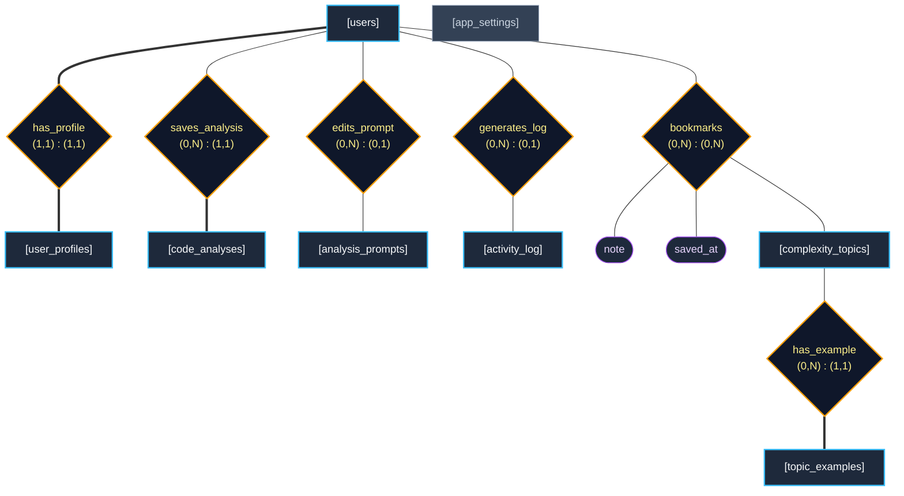

# ComplexityUniverse — Complete ER Diagram Reference & Drawing Guide

> **DBMS Course Project Documentation**  
> **Database:** `complexity_universe` (MySQL 8.0+ / Aiven Cloud)  
> **Purpose:** This reference contains every verified detail, attribute classification, cardinality constraint, structural rule, and notation guideline needed to draw 100% accurate Entity-Relationship (ER) diagrams for your DBMS course project report, presentation, and oral viva.

---

## Table of Contents

- [1. Two Types of ER Diagrams for Your Report](#1-two-types-of-er-diagrams-for-your-report)
  - [1.1 Conceptual ER Diagram (Chen's Classical Notation)](#11-conceptual-er-diagram-chens-classical-notation)
  - [1.2 Logical / Relational ER Diagram (Crow's Foot / IE Notation)](#12-logical--relational-er-diagram-crows-foot--ie-notation)
- [2. Complete Relational ER Diagram (Mermaid Crow's Foot)](#2-complete-relational-er-diagram-mermaid-crows-foot)
- [3. Complete Conceptual ER Diagram (Mermaid Chen Notation)](#3-complete-conceptual-er-diagram-mermaid-chen-notation)
- [4. Entity Classification & Attribute Taxonomy](#4-entity-classification--attribute-taxonomy)
  - [4.1 Master Entity Classification Table](#41-master-entity-classification-table)
  - [4.2 Detailed Entity Attribute Breakdown](#42-detailed-entity-attribute-breakdown)
    - [4.2.1 users](#421-users)
    - [4.2.2 user_profiles](#422-user_profiles)
    - [4.2.3 analysis_prompts](#423-analysis_prompts)
    - [4.2.4 code_analyses](#424-code_analyses)
    - [4.2.5 complexity_topics](#425-complexity_topics)
    - [4.2.6 topic_examples](#426-topic_examples)
    - [4.2.7 user_saved_topics](#427-user_saved_topics)
    - [4.2.8 activity_log](#428-activity_log)
    - [4.2.9 app_settings](#429-app_settings)
- [5. Relationships & Structural Constraints](#5-relationships--structural-constraints)
  - [5.1 Comprehensive Relationship Specifications](#51-comprehensive-relationship-specifications)
  - [5.2 (Min, Max) Structural Constraint Table](#52-min-max-structural-constraint-table)
  - [5.3 Participation & Cardinality Summary Table](#53-participation--cardinality-summary-table)
- [6. Foreign Key Referential Integrity Constraints](#6-foreign-key-referential-integrity-constraints)
- [7. Critical Academic Distinctions: Conceptual ER vs. Relational Schema](#7-critical-academic-distinctions-conceptual-er-vs-relational-schema)
- [8. Step-by-Step Drawing Guide (Chen & Crow's Foot)](#8-step-by-step-drawing-guide-chen--crows-foot)
  - [8.1 Standard Symbol Reference](#81-standard-symbol-reference)
  - [8.2 Recommended Color Palette & Aesthetics](#82-recommended-color-palette--aesthetics)
  - [8.3 Layout & Alignment Blueprint](#83-layout--alignment-blueprint)
  - [8.4 Common Drawing Mistakes to Avoid](#84-common-drawing-mistakes-to-avoid)
- [9. Relational Schema (Formal Academic Notation)](#9-relational-schema-formal-academic-notation)
- [10. DBMS Report / Viva Defense Q&A](#10-dbms-report--viva-defense-qa)

---

## 1. Two Types of ER Diagrams for Your Report

In academic DBMS evaluations (following textbooks like *Silberschatz, Korth, Sudarshan* or *Elmasri & Navathe*), professors distinguish between two modeling phases:

1. **Conceptual ER Model (Peter Chen's Notation):**
   - High-level conceptual view.
   - Uses **Rectangles** for Entities, **Diamonds** for Relationships, and **Ellipses** for Attributes.
   - Many-to-Many ($M:N$) relationships are kept as **diamonds** with relationship attributes directly attached (e.g., `note`, `saved_at`).
   - Foreign Keys are **NOT** drawn as attributes in Chen notation (relationships replace them).
   - Derived attributes are drawn as **Dashed Ellipses**.

2. **Logical / Physical ER Model (Crow's Foot / Information Engineering Notation):**
   - Implementation-level view representing the actual MySQL schema.
   - $M:N$ relationships are decomposed into an **Associative Entity** (`user_saved_topics`) connected by two $1:N$ relationships.
   - Shows all physical columns, exact SQL data types, Primary Keys (`PK`), Foreign Keys (`FK`), and unique constraints.
   - Shows precise cardinality symbols (one, many, zero-or-one, zero-or-many).

> [!TIP]
> **Best Practice for Your Report:** Include **both** diagrams in your project report. Section 3 gives you the Conceptual Chen diagram, and Section 2 gives you the Logical Crow's Foot diagram.

---

## 2. Complete Relational ER Diagram (Mermaid Crow's Foot)

You can view this directly in any Markdown previewer (VS Code, GitHub, or [mermaid.live](https://mermaid.live)):

```mermaid
erDiagram
    users {
        INT_UNSIGNED id PK "AUTO_INCREMENT"
        VARCHAR_100 name "NOT NULL"
        VARCHAR_190 email "UNIQUE, NOT NULL"
        VARCHAR_255 password_hash "NOT NULL"
        DATETIME last_login_at "NULL"
        ENUM role "user | admin, DEFAULT user"
        ENUM status "active | suspended, DEFAULT active"
        INT_UNSIGNED analysis_count "DERIVED (Triggers)"
        TIMESTAMP created_at "DEFAULT CURRENT_TIMESTAMP"
        TIMESTAMP updated_at "ON UPDATE CURRENT_TIMESTAMP"
    }

    user_profiles {
        INT_UNSIGNED id PK "AUTO_INCREMENT"
        INT_UNSIGNED user_id FK "UNIQUE, NOT NULL"
        VARCHAR_140 headline "DEFAULT 'Curious about the cost of code'"
        VARCHAR_500 bio "DEFAULT ''"
        VARCHAR_100 location "DEFAULT ''"
        VARCHAR_60 avatar_seed "DEFAULT ''"
    }

    analysis_prompts {
        TINYINT_UNSIGNED id PK "AUTO_INCREMENT"
        VARCHAR_80 name "NOT NULL"
        MEDIUMTEXT prompt_template "NOT NULL"
        TINYINT is_active "DEFAULT 1"
        INT_UNSIGNED version "DEFAULT 1 (Triggers)"
        INT_UNSIGNED updated_by FK "NULL"
        TIMESTAMP created_at "DEFAULT CURRENT_TIMESTAMP"
        TIMESTAMP updated_at "ON UPDATE CURRENT_TIMESTAMP"
    }

    code_analyses {
        BIGINT_UNSIGNED id PK "AUTO_INCREMENT"
        INT_UNSIGNED user_id FK "NOT NULL"
        VARCHAR_140 title "DEFAULT 'Untitled analysis'"
        VARCHAR_30 language "DEFAULT 'javascript'"
        MEDIUMTEXT code_text "NOT NULL"
        INT_UNSIGNED code_lines "GENERATED STORED"
        VARCHAR_40 time_complexity "NOT NULL"
        VARCHAR_40 space_complexity "NOT NULL"
        TEXT summary "NOT NULL"
        MEDIUMTEXT detailed_analysis "NOT NULL (JSON)"
        ENUM detail_mode "short | detailed, DEFAULT detailed"
        VARCHAR_20 engine "DEFAULT 'gemini'"
        INT_UNSIGNED prompt_version "NULL"
        TIMESTAMP created_at "DEFAULT CURRENT_TIMESTAMP"
        TIMESTAMP updated_at "ON UPDATE CURRENT_TIMESTAMP"
    }

    complexity_topics {
        INT_UNSIGNED id PK "AUTO_INCREMENT"
        VARCHAR_120 topic_name "NOT NULL"
        VARCHAR_140 slug "UNIQUE, NOT NULL"
        VARCHAR_60 category "DEFAULT 'Fundamentals'"
        ENUM difficulty "Beginner | Intermediate | Advanced"
        VARCHAR_40 time_complexity "NULL"
        VARCHAR_40 space_complexity "NULL"
        VARCHAR_300 summary "DEFAULT ''"
        MEDIUMTEXT notes_html "NOT NULL"
        SMALLINT sort_order "DEFAULT 0"
        TINYINT is_published "DEFAULT 1"
        TIMESTAMP created_at "DEFAULT CURRENT_TIMESTAMP"
        TIMESTAMP updated_at "ON UPDATE CURRENT_TIMESTAMP"
    }

    topic_examples {
        INT_UNSIGNED id PK "AUTO_INCREMENT"
        INT_UNSIGNED topic_id FK "NOT NULL"
        VARCHAR_140 title "NOT NULL"
        VARCHAR_30 language "DEFAULT 'javascript'"
        MEDIUMTEXT code_text "NOT NULL"
        MEDIUMTEXT analysis_html "NOT NULL"
        VARCHAR_40 time_complexity "NULL"
        VARCHAR_40 space_complexity "NULL"
        SMALLINT sort_order "DEFAULT 0"
        TIMESTAMP created_at "DEFAULT CURRENT_TIMESTAMP"
    }

    user_saved_topics {
        BIGINT_UNSIGNED id PK "AUTO_INCREMENT"
        INT_UNSIGNED user_id FK "NOT NULL"
        INT_UNSIGNED topic_id FK "NOT NULL"
        VARCHAR_255 note "DEFAULT ''"
        TIMESTAMP saved_at "DEFAULT CURRENT_TIMESTAMP"
    }

    activity_log {
        BIGINT_UNSIGNED id PK "AUTO_INCREMENT"
        INT_UNSIGNED user_id FK "NULL"
        VARCHAR_40 action "NOT NULL"
        VARCHAR_40 entity "NOT NULL"
        BIGINT_UNSIGNED entity_id "NULL"
        VARCHAR_255 detail "DEFAULT ''"
        TIMESTAMP created_at "DEFAULT CURRENT_TIMESTAMP"
    }

    app_settings {
        VARCHAR_60 setting_key PK "NOT NULL"
        TEXT setting_value "NOT NULL"
        TIMESTAMP updated_at "ON UPDATE CURRENT_TIMESTAMP"
    }

    users ||--|| user_profiles : "1:1 HAS PROFILE (CASCADE)"
    users ||--o{ code_analyses : "1:N SAVES (CASCADE)"
    users ||--o{ user_saved_topics : "1:N BOOKMARKS (CASCADE)"
    users |o--o{ activity_log : "1:N GENERATES (CASCADE)"
    users ||--o{ analysis_prompts : "1:N EDITS (SET NULL)"
    complexity_topics ||--o{ topic_examples : "1:N HAS EXAMPLE (CASCADE)"
    complexity_topics ||--o{ user_saved_topics : "1:N BOOKMARKED BY (CASCADE)"
```



---

## 3. Complete Conceptual ER Diagram (Mermaid Chen Notation)

This diagram visualizes Peter Chen's notation directly in Markdown. Entities are rectangles, relationships are rhombuses/diamonds, and attributes are ovals/stadiums:



> **Legend for Chen Diagram Above:**
> - Blue Rectangles = Entity sets
> - Gold Diamonds = Relationships with structural `(min, max)` constraints
> - Purple Ovals = Descriptive attributes belonging to the $M:N$ `bookmarks` relationship
> - Double lines (`===`) = **Total participation** (every entity instance must participate)
> - Single lines (`---`) = **Partial participation** (optional participation)

---

## 4. Entity Classification & Attribute Taxonomy

### 4.1 Master Entity Classification Table

| Entity Name | Entity Type | Role in Schema | Primary Key | Alternate / Candidate Key | Foreign Keys |
| :--- | :--- | :--- | :--- | :--- | :--- |
| **`users`** | Strong Entity | Central core user accounts | `id` | `email` | None |
| **`user_profiles`** | Dependent Entity | 1:1 user extended details | `id` | `user_id` | `user_id` $\to$ `users(id)` |
| **`analysis_prompts`** | Strong Entity | Admin-configurable AI templates | `id` | None | `updated_by` $\to$ `users(id)` |
| **`code_analyses`** | Strong Entity | Saved user code analyses | `id` | None | `user_id` $\to$ `users(id)` |
| **`complexity_topics`** | Strong Entity | Educational learning library | `id` | `slug` | None |
| **`topic_examples`** | Strong Entity | Code examples attached to topics | `id` | None | `topic_id` $\to$ `complexity_topics(id)` |
| **`user_saved_topics`** | Associative Entity | Decomposes $M:N$ bookmarks | `id` | `(user_id, topic_id)` | `user_id`, `topic_id` |
| **`activity_log`** | Strong Entity | Immutable audit trail ledger | `id` | None | `user_id` $\to$ `users(id)` |
| **`app_settings`** | Standalone Entity | Site-wide system configuration | `setting_key` | None | None |

---

### 4.2 Detailed Entity Attribute Breakdown

Use this taxonomy to determine the exact visual symbol when drawing attribute ellipses in Chen notation:

- **Key Attribute (Solid Underline):** Identifies tuples uniquely.
- **Candidate Key (Solid Underline + [CK]):** Alternate unique attribute.
- **Simple Attribute (Standard Oval):** Indivisible atomic data item.
- **Derived Attribute (Dashed Oval):** Computed dynamically or maintained via triggers.
- **Optional / Nullable Attribute (Standard Oval with `(0..1)`):** Can hold a `NULL` value.
- **Foreign Key (In Chen: Omitted; in Crow's Foot: Marked `FK`):** Referential linkage.

---

#### 4.2.1 users
*The central account entity.*

| Attribute | Data Type | Constraint | Chen Symbol | Description / Semantics |
|---|---|---|---|---|
| `id` | INT UNSIGNED | PRIMARY KEY, AUTO_INCREMENT | <u>Solid Underlined</u> | Unique account identifier |
| `name` | VARCHAR(100) | NOT NULL | Standard Oval | Full display name |
| `email` | VARCHAR(190) | UNIQUE, NOT NULL | <u>Solid Underlined</u> [CK] | Login email address |
| `password_hash` | VARCHAR(255) | NOT NULL | Standard Oval | bcrypt-hashed password |
| `last_login_at` | DATETIME | NULL | Standard Oval (opt) | Timestamp of most recent sign-in |
| `role` | ENUM('user','admin')| NOT NULL, DEFAULT 'user' | Standard Oval | Authorization level |
| `status` | ENUM('active','suspended')| NOT NULL, DEFAULT 'active' | Standard Oval | Account moderation status |
| `analysis_count` | INT UNSIGNED | NOT NULL, DEFAULT 0 | **Dashed Oval** | **Derived attribute** (maintained by triggers) |
| `created_at` | TIMESTAMP | DEFAULT CURRENT_TIMESTAMP | Standard Oval | Account registration timestamp |
| `updated_at` | TIMESTAMP | ON UPDATE CURRENT_TIMESTAMP| Standard Oval | Last account update timestamp |

---

#### 4.2.2 user_profiles
*Stores biographical data in a strict 1:1 relationship with `users`.*

| Attribute | Data Type | Constraint | Chen Symbol | Description / Semantics |
|---|---|---|---|---|
| `id` | INT UNSIGNED | PRIMARY KEY, AUTO_INCREMENT | <u>Solid Underlined</u> | Profile row identifier |
| `user_id` | INT UNSIGNED | UNIQUE, NOT NULL, FK $\to$ `users.id` | <u>Solid Underlined</u> [CK] | Referenced user account |
| `headline` | VARCHAR(140) | NOT NULL | Standard Oval | Professional tagline / slogan |
| `bio` | VARCHAR(500) | NOT NULL | Standard Oval | User biography / background |
| `location` | VARCHAR(100) | NOT NULL | Standard Oval | City / country location string |
| `avatar_seed` | VARCHAR(60) | NOT NULL | Standard Oval | Seed for deterministic SVG avatar |

---

#### 4.2.3 analysis_prompts
*Configurable Gemini prompt templates with audit-versioning.*

| Attribute | Data Type | Constraint | Chen Symbol | Description / Semantics |
|---|---|---|---|---|
| `id` | TINYINT UNSIGNED | PRIMARY KEY, AUTO_INCREMENT | <u>Solid Underlined</u> | Prompt identifier |
| `name` | VARCHAR(80) | NOT NULL | Standard Oval | Internal prompt name |
| `prompt_template` | MEDIUMTEXT | NOT NULL | Standard Oval | Complete LLM system prompt text |
| `is_active` | TINYINT(1) | NOT NULL, DEFAULT 1 | Standard Oval | Flag indicating currently active prompt |
| `version` | INT UNSIGNED | NOT NULL, DEFAULT 1 | Standard Oval | Version counter (auto-incremented by trigger) |
| `updated_by` | INT UNSIGNED | NULL, FK $\to$ `users.id` | Standard Oval (opt) | Admin user who modified the template |
| `created_at` | TIMESTAMP | DEFAULT CURRENT_TIMESTAMP | Standard Oval | Creation timestamp |
| `updated_at` | TIMESTAMP | ON UPDATE CURRENT_TIMESTAMP| Standard Oval | Modification timestamp |

---

#### 4.2.4 code_analyses
*Stores saved Big-O evaluations.*

| Attribute | Data Type | Constraint | Chen Symbol | Description / Semantics |
|---|---|---|---|---|
| `id` | BIGINT UNSIGNED | PRIMARY KEY, AUTO_INCREMENT | <u>Solid Underlined</u> | Analysis record identifier |
| `user_id` | INT UNSIGNED | NOT NULL, FK $\to$ `users.id` | FK (Omit in Chen) | Owning user |
| `title` | VARCHAR(140) | NOT NULL | Standard Oval | User-assigned snippet title |
| `language` | VARCHAR(30) | NOT NULL | Standard Oval | Programming language (js, py, cpp, etc.) |
| `code_text` | MEDIUMTEXT | NOT NULL | Standard Oval | Submitted source code |
| `code_lines` | INT UNSIGNED | GENERATED ALWAYS ... STORED | **Dashed Oval** | **Derived attribute** (computed from newlines) |
| `time_complexity` | VARCHAR(40) | NOT NULL | Standard Oval | Asymptotic time complexity (e.g., O(n)) |
| `space_complexity` | VARCHAR(40) | NOT NULL | Standard Oval | Asymptotic space complexity (e.g., O(1)) |
| `summary` | TEXT | NOT NULL | Standard Oval | Plain-text explanation |
| `detailed_analysis` | MEDIUMTEXT | NOT NULL | Standard Oval | JSON-structured line-by-line breakdown |
| `detail_mode` | ENUM('short','detailed') | NOT NULL | Standard Oval | Analysis mode |
| `engine` | VARCHAR(20) | NOT NULL | Standard Oval | Engine name ('gemini') |
| `prompt_version` | INT UNSIGNED | NULL | Standard Oval (opt) | Prompt version used (audit trail) |
| `created_at` | TIMESTAMP | DEFAULT CURRENT_TIMESTAMP | Standard Oval | Analysis date and time |
| `updated_at` | TIMESTAMP | ON UPDATE CURRENT_TIMESTAMP| Standard Oval | Last modified date and time |

---

#### 4.2.5 complexity_topics
*Educational content for the Learn library.*

| Attribute | Data Type | Constraint | Chen Symbol | Description / Semantics |
|---|---|---|---|---|
| `id` | INT UNSIGNED | PRIMARY KEY, AUTO_INCREMENT | <u>Solid Underlined</u> | Topic identifier |
| `topic_name` | VARCHAR(120) | NOT NULL | Standard Oval | Display title (e.g., "Binary Search") |
| `slug` | VARCHAR(140) | UNIQUE, NOT NULL | <u>Solid Underlined</u> [CK] | URL slug (e.g., "binary-search") |
| `category` | VARCHAR(60) | NOT NULL | Standard Oval | Topic category (Fundamentals, Trees, etc.) |
| `difficulty` | ENUM('Beginner',...) | NOT NULL | Standard Oval | Difficulty tier |
| `time_complexity` | VARCHAR(40) | NULL | Standard Oval (opt) | Characteristic time complexity |
| `space_complexity` | VARCHAR(40) | NULL | Standard Oval (opt) | Characteristic space complexity |
| `summary` | VARCHAR(300) | NOT NULL | Standard Oval | Brief teaser description |
| `notes_html` | MEDIUMTEXT | NOT NULL | Standard Oval | HTML educational body content |
| `sort_order` | SMALLINT | NOT NULL, DEFAULT 0 | Standard Oval | Presentation sequence order |
| `is_published` | TINYINT(1) | NOT NULL, DEFAULT 1 | Standard Oval | Publication status toggle |
| `created_at` | TIMESTAMP | DEFAULT CURRENT_TIMESTAMP | Standard Oval | Creation timestamp |
| `updated_at` | TIMESTAMP | ON UPDATE CURRENT_TIMESTAMP| Standard Oval | Last edit timestamp |

---

#### 4.2.6 topic_examples
*Runnable algorithms attached to educational topics.*

| Attribute | Data Type | Constraint | Chen Symbol | Description / Semantics |
|---|---|---|---|---|
| `id` | INT UNSIGNED | PRIMARY KEY, AUTO_INCREMENT | <u>Solid Underlined</u> | Example identifier |
| `topic_id` | INT UNSIGNED | NOT NULL, FK $\to$ `complexity_topics.id` | FK (Omit in Chen) | Parent educational topic |
| `title` | VARCHAR(140) | NOT NULL | Standard Oval | Example title |
| `language` | VARCHAR(30) | NOT NULL | Standard Oval | Language code |
| `code_text` | MEDIUMTEXT | NOT NULL | Standard Oval | Executable source code snippet |
| `analysis_html` | MEDIUMTEXT | NOT NULL | Standard Oval | Explanation of code complexity |
| `time_complexity` | VARCHAR(40) | NULL | Standard Oval (opt) | Measured/analyzed time complexity |
| `space_complexity` | VARCHAR(40) | NULL | Standard Oval (opt) | Measured/analyzed space complexity |
| `sort_order` | SMALLINT | NOT NULL, DEFAULT 0 | Standard Oval | Display order within topic |
| `created_at` | TIMESTAMP | DEFAULT CURRENT_TIMESTAMP | Standard Oval | Timestamp created |

---

#### 4.2.7 user_saved_topics
*Associative junction table resolving the $M:N$ bookmark relationship.*

| Attribute | Data Type | Constraint | Chen Symbol | Description / Semantics |
|---|---|---|---|---|
| `id` | BIGINT UNSIGNED | PRIMARY KEY, AUTO_INCREMENT | <u>Solid Underlined</u> | Surrogate bookmark identifier |
| `user_id` | INT UNSIGNED | NOT NULL, FK $\to$ `users.id` | FK (Part of CK) | Bookmarking user |
| `topic_id` | INT UNSIGNED | NOT NULL, FK $\to$ `complexity_topics.id` | FK (Part of CK) | Bookmarked topic |
| `note` | VARCHAR(255) | NOT NULL, DEFAULT '' | Standard Oval | User's personal bookmark note |
| `saved_at` | TIMESTAMP | DEFAULT CURRENT_TIMESTAMP | Standard Oval | Bookmark creation timestamp |

> **Chen Modeling Note:** In a pure Chen diagram, `user_saved_topics` does not appear as a rectangle. It appears as the **diamond** `bookmarks` connecting `users` and `complexity_topics`, with `note` and `saved_at` attached as attribute ovals.

---

#### 4.2.8 activity_log
*Audit trail recording trigger-generated events.*

| Attribute | Data Type | Constraint | Chen Symbol | Description / Semantics |
|---|---|---|---|---|
| `id` | BIGINT UNSIGNED | PRIMARY KEY, AUTO_INCREMENT | <u>Solid Underlined</u> | Unique event sequence ID |
| `user_id` | INT UNSIGNED | NULL, FK $\to$ `users.id` | Standard Oval (opt) | Actor ID (NULL for system events) |
| `action` | VARCHAR(40) | NOT NULL | Standard Oval | Action type (register, analysis_saved) |
| `entity` | VARCHAR(40) | NOT NULL | Standard Oval | Affected entity table name |
| `entity_id` | BIGINT UNSIGNED | NULL | Standard Oval (opt) | Affected entity primary key |
| `detail` | VARCHAR(255) | NOT NULL | Standard Oval | Human-readable event description |
| `created_at` | TIMESTAMP | DEFAULT CURRENT_TIMESTAMP | Standard Oval | Event occurrence timestamp |

---

#### 4.2.9 app_settings
*Standalone system configuration dictionary.*

| Attribute | Data Type | Constraint | Chen Symbol | Description / Semantics |
|---|---|---|---|---|
| `setting_key` | VARCHAR(60) | PRIMARY KEY | <u>Solid Underlined</u> | Configuration key (e.g., 'gemini_model') |
| `setting_value` | TEXT | NOT NULL | Standard Oval | Stored value string |
| `updated_at` | TIMESTAMP | ON UPDATE CURRENT_TIMESTAMP| Standard Oval | Last modification timestamp |

---

## 5. Relationships & Structural Constraints

### 5.1 Comprehensive Relationship Specifications

#### R1: users ↔ user_profiles (`has_profile`)
- **Cardinality Ratio:** $1:1$ (One-to-One)
- **Structural Constraint (users):** $(1, 1)$ — Every user must have exactly 1 profile. Enforced via database trigger `trg_users_after_insert`.
- **Structural Constraint (user_profiles):** $(1, 1)$ — Every profile row must reference exactly 1 valid user account (`user_id NOT NULL UNIQUE`).
- **Participation:** **Total on both sides** (Double lines on both entity links).
- **Referential Integrity:** `ON DELETE CASCADE`, `ON UPDATE CASCADE`.

---

#### R2: users ↔ code_analyses (`saves_analysis`)
- **Cardinality Ratio:** $1:N$ (One-to-Many)
- **Structural Constraint (users):** $(0, N)$ — A user starts with 0 analyses and can save infinitely many.
- **Structural Constraint (code_analyses):** $(1, 1)$ — Every analysis must belong to exactly one user account (`user_id NOT NULL`).
- **Participation:** Partial on `users`, **Total on `code_analyses`** (Double line on `code_analyses` link).
- **Referential Integrity:** `ON DELETE CASCADE`, `ON UPDATE CASCADE`.

---

#### R3: users ↔ complexity_topics (`bookmarks`) — *Conceptual M:N*
- **Cardinality Ratio:** $M:N$ (Many-to-Many)
- **Structural Constraint (users):** $(0, N)$ — A user can bookmark 0 or many topics.
- **Structural Constraint (complexity_topics):** $(0, N)$ — A topic can be bookmarked by 0 or many users.
- **Participation:** Partial on both sides (Single lines on both links).
- **Descriptive Attributes of Relationship:** `note`, `saved_at`.
- **Relational Decomposition:** Decomposed into associative table `user_saved_topics` with two $1:N$ foreign key constraints.

---

#### R4: complexity_topics ↔ topic_examples (`has_example`)
- **Cardinality Ratio:** $1:N$ (One-to-Many)
- **Structural Constraint (complexity_topics):** $(0, N)$ — A topic can have 0 or many runnable examples.
- **Structural Constraint (topic_examples):** $(1, 1)$ — Every example must belong to exactly one topic (`topic_id NOT NULL`).
- **Participation:** Partial on `complexity_topics`, **Total on `topic_examples`** (Double line on `topic_examples` link).
- **Referential Integrity:** `ON DELETE CASCADE`, `ON UPDATE CASCADE`.

---

#### R5: users ↔ analysis_prompts (`edits_prompt`)
- **Cardinality Ratio:** $1:N$ (One-to-Many)
- **Structural Constraint (users):** $(0, N)$ — A user (specifically an admin) can edit 0, 1, or many prompt templates.
- **Structural Constraint (analysis_prompts):** $(0, 1)$ — A prompt template is either initial (no editor, `updated_by = NULL`) or has been edited by at most 1 user.
- **Participation:** Partial on both sides (Single lines on both links).
- **Referential Integrity:** `ON DELETE SET NULL`, `ON UPDATE CASCADE`. If the editing admin account is deleted, the prompt template remains preserved with `updated_by = NULL`.

---

#### R6: users ↔ activity_log (`generates_log`)
- **Cardinality Ratio:** $1:N$ (One-to-Many)
- **Structural Constraint (users):** $(0, N)$ — A user can generate 0 or many activity logs.
- **Structural Constraint (activity_log):** $(0, 1)$ — An activity log row is either tied to 1 registered user or is a system-level event with `user_id = NULL`.
- **Participation:** Partial on both sides (Single lines on both links).
- **Referential Integrity:** `ON DELETE CASCADE`, `ON UPDATE CASCADE`.

---

### 5.2 (Min, Max) Structural Constraint Table

In textbook ER modeling, the $(min, max)$ notation replaces cardinality ratios and participation flags with a single, unambiguous pair:

| Relationship Name | Participating Entity | Min Instances | Max Instances | $(min, max)$ Notation | Meaning |
| :--- | :--- | :---: | :---: | :---: | :--- |
| **`has_profile`** | `users` | 1 | 1 | **(1, 1)** | Mandatory: Exactly 1 profile per user |
| | `user_profiles` | 1 | 1 | **(1, 1)** | Mandatory: Exactly 1 user per profile |
| **`saves_analysis`**| `users` | 0 | $N$ | **(0, N)** | Optional: 0 to many analyses per user |
| | `code_analyses` | 1 | 1 | **(1, 1)** | Mandatory: Must belong to 1 user |
| **`bookmarks`** *(M:N)*| `users` | 0 | $N$ | **(0, N)** | Optional: 0 to many bookmarked topics |
| | `complexity_topics` | 0 | $N$ | **(0, N)** | Optional: Bookmarked by 0 to many users |
| **`has_example`** | `complexity_topics` | 0 | $N$ | **(0, N)** | Optional: 0 to many code examples |
| | `topic_examples` | 1 | 1 | **(1, 1)** | Mandatory: Must belong to 1 topic |
| **`edits_prompt`** | `users` | 0 | $N$ | **(0, N)** | Optional: Admin edits 0 to many prompts |
| | `analysis_prompts` | 0 | 1 | **(0, 1)** | Optional: Edited by 0 or 1 user |
| **`generates_log`** | `users` | 0 | $N$ | **(0, N)** | Optional: Generates 0 to many logs |
| | `activity_log` | 0 | 1 | **(0, 1)** | Optional: Generated by 0 or 1 user |

---

### 5.3 Participation & Cardinality Summary Table

| Relationship | Entity 1 | Cardinality | Entity 2 | Participation 1 | Participation 2 | Visual Line Style |
| :--- | :--- | :---: | :--- | :---: | :---: | :--- |
| **`has_profile`** | `users` | **1 : 1** | `user_profiles` | **Total** | **Total** | Double line ↔ Double line |
| **`saves_analysis`**| `users` | **1 : N** | `code_analyses` | Partial | **Total** | Single line ↔ Double line |
| **`has_example`** | `complexity_topics` | **1 : N** | `topic_examples` | Partial | **Total** | Single line ↔ Double line |
| **`edits_prompt`** | `users` | **1 : N** | `analysis_prompts` | Partial | Partial | Single line ↔ Single line |
| **`generates_log`** | `users` | **1 : N** | `activity_log` | Partial | Partial | Single line ↔ Single line |
| **`bookmarks`** *(M:N)* | `users` | **M : N** | `complexity_topics` | Partial | Partial | Single line ↔ Single line |

---

## 6. Foreign Key Referential Integrity Constraints

| Constraint Symbol | Child Table | Child Column | Parent Table | Parent Column | Action ON DELETE | Action ON UPDATE |
| :--- | :--- | :--- | :--- | :--- | :---: | :---: |
| `fk_profile_user` | `user_profiles` | `user_id` | `users` | `id` | **CASCADE** | CASCADE |
| `fk_analyses_user` | `code_analyses` | `user_id` | `users` | `id` | **CASCADE** | CASCADE |
| `fk_saved_user` | `user_saved_topics` | `user_id` | `users` | `id` | **CASCADE** | CASCADE |
| `fk_saved_topic` | `user_saved_topics` | `topic_id` | `complexity_topics` | `id` | **CASCADE** | CASCADE |
| `fk_examples_topic` | `topic_examples` | `topic_id` | `complexity_topics` | `id` | **CASCADE** | CASCADE |
| `fk_log_user` | `activity_log` | `user_id` | `users` | `id` | **CASCADE** | CASCADE |
| `fk_prompt_admin` | `analysis_prompts` | `updated_by` | `users` | `id` | **SET NULL** | CASCADE |

> **Architectural Defense:** 6 out of 7 foreign keys use `ON DELETE CASCADE` to prevent orphaned records upon user or topic deletion. Only `fk_prompt_admin` uses `ON DELETE SET NULL` because AI prompt templates are mission-critical application configurations that must survive even if the administrator who modified them leaves the system.

---

## 7. Critical Academic Distinctions: Conceptual ER vs. Relational Schema

Examiners strictly look for students' understanding of the transition from conceptual models to relational tables:

```
┌────────────────────────────────────────────────────────────────────────┐
│                        CONCEPTUAL ER (CHEN)                            │
│                                                                        │
│   ┌─────────┐                ┌───────────┐                ┌──────────┐ │
│   │  users  │────────(0,N)───│ bookmarks │───(0,N)────────│  topics  │ │
│   └─────────┘                └─────┬─────┘                └──────────┘ │
│                                    │                                   │
│                               ┌────┴────┐                              │
│                               │ note    │                              │
│                               │ saved_at│                              │
│                               └─────────┘                              │
└────────────────────────────────────┬───────────────────────────────────┘
                                     │ Relational Mapping (M:N Rule)
                                     ▼
┌────────────────────────────────────────────────────────────────────────┐
│                   LOGICAL / RELATIONAL SCHEMA (CROW'S FOOT)            │
│                                                                        │
│   ┌─────────┐              ┌───────────────────┐          ┌──────────┐ │
│   │  users  │───1──────N───│ user_saved_topics │───N──────│  topics  │ │
│   └─────────┘              └───────────────────┘          └──────────┘ │
│                              • id (PK)                                 │
│                              • user_id (FK)                            │
│                              • topic_id (FK)                           │
│                              • note                                    │
│                              • saved_at                                │
└────────────────────────────────────────────────────────────────────────┘
```

1. **Foreign Keys in Chen Diagrams:** In pure Chen notation, **never draw foreign keys as attribute ellipses**. The relationship diamond itself models the connection! Writing `user_id` as an attribute of `code_analyses` in a Chen diagram is a common grading penalty.
2. **Associative Entities:** In Chen notation, $M:N$ relationships are diamonds with attributes. In relational schema, relational engines (MySQL) cannot directly store an $M:N$ pointer array, so the relationship collapses into an associative junction table (`user_saved_topics`).
3. **Derived Attributes:** Attributes calculated from other values (`analysis_count` and `code_lines`) must be drawn with a **dashed ellipse** in Chen notation.

---

## 8. Step-by-Step Drawing Guide (Chen & Crow's Foot)

### 8.1 Standard Symbol Reference

| Modeling Element | Chen Notation Symbol | Crow's Foot / IE Symbol |
| :--- | :--- | :--- |
| **Regular Entity** | Solid Rectangle | Table Box with name header |
| **Weak Entity** | Double Rectangle *(Not present)* | Child table with identifying FK |
| **Relationship** | Diamond / Rhombus | Connecting Line with crows foot |
| **Key Attribute** | Ellipse with solid underlined text | Attribute marked with `PK` |
| **Partial / Candidate Key**| Ellipse with dashed underline / `[CK]` | Attribute marked with `UQ` / `AK` |
| **Derived Attribute** | **Dashed Ellipse** | Marked `[derived]` or `GENERATED` |
| **Total Participation** | **Double Line** to relationship diamond | Line with mandatory vertical bar (`\|`) |
| **Partial Participation**| **Single Line** to relationship diamond | Line with circle (`o`) |

---

### 8.2 Recommended Color Palette & Aesthetics

When using software like **draw.io**, **Lucidchart**, or **Canva**, use this consistent, professional palette:

- **Entity Rectangles:** Slate Blue / Navy (`#1E293B` background, `#38BDF8` border, white bold text)
- **Relationship Diamonds:** Dark Amber (`#0F172A` background, `#F59E0B` border, golden text)
- **Attribute Ellipses:** Light Gray / Soft Steel (`#F8FAFC` background, `#64748B` border, dark text)
- **Key Attributes:** Soft Yellow highlight (`#FEF08A` background, bold underlined text)
- **Derived Attributes:** Dashed border (`#94A3B8` dashed border)
- **Relationship Lines:** Dark Charcoal (`#334155`, 1.5pt thickness)
- **Total Participation Lines:** Double parallel lines (`===`, 2pt thickness)

---

### 8.3 Layout & Alignment Blueprint

To keep your diagram neat and prevent intersecting diagonal lines:

```
                            ┌────────────────┐
                            │  app_settings  │  (Standalone, Top Right)
                            └────────────────┘

       ┌────────────────────────────────────────────────────────┐
       │                                                        │
       │                   ┌──────────────┐                     │
       │     ┌────────────►│    users     │◄────────────┐       │
       │     │ (1,1):(1,1) └──────┬───────┘ (0,N):(0,1) │       │
       │     │                    │                     │       │
       │ ┌───┴──────────┐   (0,N) │ (1,1)          ┌────┴─────┐ │
       │ │user_profiles │         ▼                │ analysis_│ │
       │ └──────────────┘  ┌──────────────┐        │ prompts  │ │
       │                   │code_analyses │        └──────────┘ │
       │                   └──────────────┘                     │
       │                                                        │
       │   ┌───────────────────┐          ┌────────────────┐    │
       │   │complexity_topics  │─────────►│ topic_examples │    │
       │   └─────────┬─────────┘ (0,N)    └────────────────┘    │
       │             │           (1,1)                          │
       │       (0,N) │                                          │
       │             ▼                                          │
       │   ┌───────────────────┐                                │
       │   │ user_saved_topics │◄──────── users (0,N)           │
       │   └───────────────────┘                                │
       │                                                        │
       │   ┌───────────────────┐                                │
       │   │   activity_log    │◄──────── users (0,N)           │
       │   └───────────────────┘                                │
       └────────────────────────────────────────────────────────┘
```

---

### 8.4 Common Drawing Mistakes to Avoid

1. ❌ **Drawing Foreign Keys in Chen Diagrams:** Do not connect an ellipse labeled `user_id` to `code_analyses` in Chen notation. The `saves_analysis` diamond represents the connection!
2. ❌ **Forgetting Dashed Ellipses:** `analysis_count` in `users` and `code_lines` in `code_analyses` are derived. Drawing them as solid ovals will lose points.
3. ❌ **Confusing Total and Partial Participation:**
   - A new user might not have any analyses yet $\implies$ `users` participation in `saves_analysis` is **partial** (single line).
   - An analysis cannot exist without a user $\implies$ `code_analyses` participation is **total** (double line).
4. ❌ **Drawing `app_settings` with lines:** `app_settings` is a standalone configuration entity with no foreign keys. Do not invent relationships to it.

---

## 9. Relational Schema (Formal Academic Notation)

For text-based report submissions, use the standard relational notation where **Primary Keys** are underlined and **Foreign Keys** are marked with an asterisk (`*`):

```
users (
    __id__, name, email [CK], password_hash, last_login_at, role, status,
    analysis_count [derived], created_at, updated_at
)

user_profiles (
    __id__, *user_id* [CK], headline, bio, location, avatar_seed
)
    FOREIGN KEY (*user_id*) REFERENCES users(id) ON DELETE CASCADE

analysis_prompts (
    __id__, name, prompt_template, is_active, version, *updated_by*,
    created_at, updated_at
)
    FOREIGN KEY (*updated_by*) REFERENCES users(id) ON DELETE SET NULL

code_analyses (
    __id__, *user_id*, title, language, code_text, code_lines [derived],
    time_complexity, space_complexity, summary, detailed_analysis,
    detail_mode, engine, prompt_version, created_at, updated_at
)
    FOREIGN KEY (*user_id*) REFERENCES users(id) ON DELETE CASCADE

complexity_topics (
    __id__, topic_name, slug [CK], category, difficulty,
    time_complexity, space_complexity, summary, notes_html,
    sort_order, is_published, created_at, updated_at
)

topic_examples (
    __id__, *topic_id*, title, language, code_text, analysis_html,
    time_complexity, space_complexity, sort_order, created_at
)
    FOREIGN KEY (*topic_id*) REFERENCES complexity_topics(id) ON DELETE CASCADE

user_saved_topics (
    __id__, *user_id*, *topic_id*, note, saved_at
)
    CANDIDATE KEY: (*user_id*, *topic_id*)
    FOREIGN KEY (*user_id*) REFERENCES users(id) ON DELETE CASCADE
    FOREIGN KEY (*topic_id*) REFERENCES complexity_topics(id) ON DELETE CASCADE

activity_log (
    __id__, *user_id*, action, entity, entity_id, detail, created_at
)
    FOREIGN KEY (*user_id*) REFERENCES users(id) ON DELETE CASCADE

app_settings (
    __setting_key__, setting_value, updated_at
)
```

---

## 10. DBMS Report / Viva Defense Q&A

### Q1: Is there any Weak Entity in this database schema?
**Answer:**
No. In strict relational theory, a **Weak Entity** cannot be identified by its own attributes alone and must borrow the primary key of an identifying owner entity via an identifying relationship (drawn with a double rectangle).  
In `complexity_universe`, all 9 tables possess their own independent Primary Keys (`id` or `setting_key`). While tables like `topic_examples` and `user_profiles` depend on parent records for their existential lifecycle (`ON DELETE CASCADE`), their physical identification uses independent surrogate auto-increment keys. Thus, all entities are formally **Strong Entities**.

---

### Q2: Why is the relationship between `users` and `user_profiles` 1:1, and why is participation total on both sides?
**Answer:**
- **Cardinality:** One user has at most one profile, and each profile belongs to exactly one user. This is strictly enforced in MySQL by placing a `UNIQUE KEY uq_profile_user (user_id)` constraint on the foreign key column.
- **Participation:**
  - `user_profiles` $\to$ `users`: Total, because `user_id` is defined as `NOT NULL`. A profile cannot exist without a user.
  - `users` $\to$ `user_profiles`: Total, because the database trigger `trg_users_after_insert` automatically creates a corresponding `user_profiles` row immediately whenever a new user registers.

---

### Q3: How is the Many-to-Many ($M:N$) bookmark relationship represented in the Conceptual ER vs. Relational Model?
**Answer:**
- In the **Conceptual ER model (Chen's notation)**, it is represented as a single relationship diamond labeled `bookmarks` connecting `users` and `complexity_topics` with $(0, N)$ constraints on both sides. The descriptive attributes `note` and `saved_at` are attached directly to this diamond.
- In the **Relational model**, relational database engines cannot store direct $M:N$ arrays. It is therefore mapped into an **Associative Entity** (`user_saved_topics`) containing two foreign keys (`user_id` and `topic_id`) along with a composite candidate key constraint `UNIQUE KEY (user_id, topic_id)`.

---

### Q4: Why are `users.analysis_count` and `code_analyses.code_lines` drawn as dashed ellipses?
**Answer:**
In Peter Chen's notation, a **Dashed Ellipse** represents a **Derived Attribute** — an attribute whose value is computed from other attributes or aggregated from related tuples rather than being an independent primary data fact:
- `users.analysis_count` is derived by counting the rows in `code_analyses` for that user (`COUNT(*)`), maintained in real-time by insert/delete triggers.
- `code_analyses.code_lines` is a MySQL `GENERATED ALWAYS AS (CHAR_LENGTH(code_text) - CHAR_LENGTH(REPLACE(code_text, '\n', '')) + 1) STORED` column computed directly from the newline count in `code_text`.

---

### Q5: Why is `analysis_prompts.updated_by` set to `ON DELETE SET NULL` while all other foreign keys use `ON DELETE CASCADE`?
**Answer:**
This is an important design choice for system durability:
- Entities like `user_profiles`, `code_analyses`, and `activity_log` are personal data belonging exclusively to that user. When a user is purged, their private data should be cleaned up automatically (`CASCADE`).
- In contrast, `analysis_prompts` contains global application-wide AI prompt templates. If the administrator who last edited the prompt template deletes their account, the application must **NOT** delete the AI prompt template (which would break the entire code analysis engine). Instead, `updated_by` is set to `NULL`, preserving the template while maintaining referential integrity.
